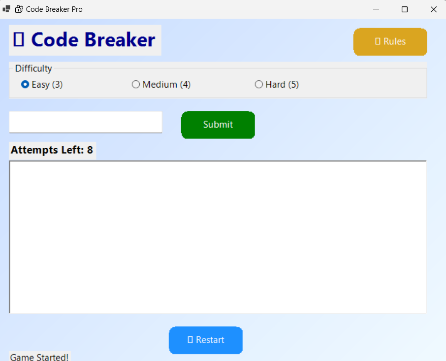
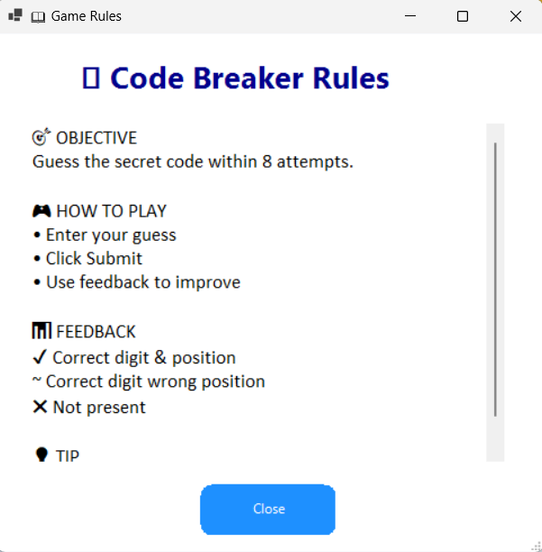
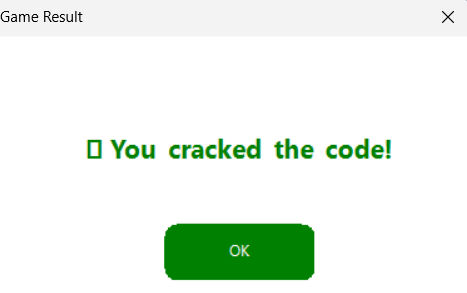

# 🔐 CodeBreaker Pro

A sleek, modern Windows Forms puzzle game built with C# and .NET 8. Test your logic and deduction skills by cracking the secret numeric code before you run out of attempts!

---

## 🎮 Game Overview

**CodeBreaker Pro** is a classic code-breaking (Mastermind-style) desktop game. The application generates a random secret code, and your mission is to guess it within a limited number of tries. After each guess, you receive detailed feedback indicating which digits are correct and whether they are in the right position.

- **3 Difficulty Levels**: Easy (3 digits), Medium (4 digits), Hard (5 digits)
- **8 Attempts** to crack the code
- **Real-time Hints & Feedback** to guide your strategy
- **Beautiful Modern UI** with gradient backgrounds, rounded buttons, and smooth fade-in animations

---

## ✨ Features

- 🎨 **Stunning UI**
  - Custom gradient backgrounds (`LinearGradientBrush`)
  - Rounded, flat-style buttons with custom `GraphicsPath`
  - Responsive, centered layouts and clean Segoe UI / Consolas typography

- 🧠 **Smart Feedback**
  - `✔` — Correct digit in the correct position
  - `~` — Correct digit in the wrong position
  - `✖` — Digit not in the code

- 🏆 **Result Popups**
  - Animated `FadeForm` dialogs for win/lose states
  - Context-aware colors (green for wins, red for losses)

- 📖 **Rules Panel**
  - Accessible in-game rules dialog with explanations, tips, and symbol meanings

- ⚙️ **Difficulty Selector**
  - Switch between Easy, Medium, and Hard at any time to restart with a new challenge

---

## 🖼️ Screenshots

> *Coming soon — add screenshots of the gameplay, rules panel, and result dialogs here.



*

---

## 🛠️ Tech Stack

| Technology | Details |
|------------|---------|
| **Framework** | .NET 8 (Windows) |
| **UI** | Windows Forms (WinForms) with GDI+ custom painting |
| **Language** | C# 12 |
| **IDE** | Visual Studio / VS Code |

---

## 🚀 Getting Started

### Prerequisites

- Windows OS
- [.NET 8 SDK](https://dotnet.microsoft.com/en-us/download/dotnet/8.0) or later installed

### Clone & Run

```bash
git clone https://github.com/YOUR_USERNAME/CodeBreaker.git
cd CodeBreaker
dotnet run
```

Alternatively, open the `CodeBreaker.csproj` in **Visual Studio** and run with `F5`.

### Build

```bash
dotnet build --configuration Release
```

The compiled executable will be located in:

```
bin/Release/net8.0-windows/CodeBreaker.exe
```

---

## 📖 How to Play

1. Select your desired difficulty (Easy | Medium | Hard)
2. Type your numeric guess into the input box
3. Click **Submit**
4. Analyze the feedback and refine your next guess
5. Crack the code within **8 attempts** to win!

**Pro Tip:** Start with digits that are all different to maximize the information you get from each hint.

---

## 📁 Project Structure

```
CodeBreaker/
├── CodeBreaker.csproj          # MSBuild project file
├── Form1.cs                    # Main game logic & UI
├── Program.cs                  # Entry point (inside Form1.cs)
│
├── bin/
│   └── Debug/net8.0-windows/   # Build output
└── obj/
    └── ...                     # Intermediate build files
```

---

## 🧪 Development Notes

- The game logic is fully contained in `Form1.cs`.
- `RulesForm` and `ResultForm` inherit from a shared `FadeForm` base class for smooth opacity animation.
- All UI customizations (rounded buttons, gradient BG) are drawn manually with `GraphicsPath` and `LinearGradientBrush`.

---

## 🔗 Dependencies

This project uses only the built-in Windows / .NET SDK libraries — no external NuGet packages are required.

```json
{
  "runtimeTarget": {
    "name": ".NETCoreApp,Version=v8.0"
  },
  "libraries": {
    "CodeBreaker/1.0.0": {
      "type": "project"
    }
  }
}
```

---

## 📄 License

This project is open source and available under the [MIT License](LICENSE).

---

## 🤝 Contributing

Contributions are welcome! Feel free to open issues or submit pull requests for new features, difficulty modes, themes, or UI enhancements.

---

## 👨‍💻 Author

Built with 💻 & ☕ using C# and .NET 8.

---

> **Ready to break some codes?** 🔥

